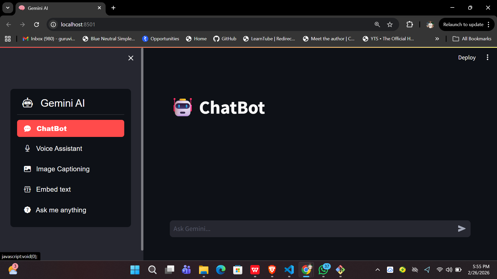

# 🧠 Gemini AI Assistant — Multi-Modal Chatbot with Voice Support

A powerful **AI Assistant Web App** built using **Google Gemini API + Streamlit** that supports:

* 💬 Conversational Chatbot
* 🎤 Voice Assistant (Speech-to-Text + Text-to-Speech)
* 🖼️ Image Captioning
* 🔡 Text Embeddings Generator
* ❓ Ask-Anything AI Query

This project demonstrates integration of **Generative AI, Multimodal AI, and Voice Interaction** in a single application.

---

## 🚀 Features

✅ Chat with Gemini AI (context-aware conversation)
✅ Voice Assistant using microphone input
✅ AI response speech output (browser speech synthesis)
✅ Image caption generation using Gemini Vision
✅ Text embedding generation
✅ Replay / Stop voice controls
✅ Modern Streamlit UI with sidebar navigation

---

## 🏗️ Tech Stack

| Technology            | Usage            |
| --------------------- | ---------------- |
| Python                | Core programming |
| Streamlit             | Web interface    |
| Google Gemini API     | Generative AI    |
| SpeechRecognition     | Voice input      |
| Web Speech API        | Voice output     |
| Pillow                | Image processing |
| Streamlit Option Menu | Navigation UI    |

---

## 📂 Project Structure

```
AI_Gemini_chatbot/
│── main.py                 # Streamlit application
│── gemini_utility.py       # Gemini API functions
│── config.json             # API key configuration
│── requirements.txt        # Dependencies
│── README.md               # Project documentation
```

---

## ⚙️ Installation

### 1️⃣ Clone Repository

```bash
git clone https://github.com/yourusername/AI_Gemini_chatbot.git
cd AI_Gemini_chatbot
```

### 2️⃣ Create Virtual Environment

```bash
python -m venv .venv
```

Activate:

Windows:

```bash
.venv\Scripts\activate
```

Mac/Linux:

```bash
source .venv/bin/activate
```

### 3️⃣ Install Requirements

```bash
pip install -r requirements.txt
```

---

## 🔑 Setup API Key

Create a file named:

```
config.json
```

Add:

```json
{
  "GOOGLE_API_KEY": "YOUR_API_KEY_HERE"
}
```

Get API key from:
https://makersuite.google.com/app/apikey

---

## ▶️ Run Application

```bash
streamlit run main.py
```

App will open at:

```
http://localhost:8501
```

---

## 🎤 Voice Features

* Speak AI responses
* Replay voice
* Stop voice anytime
* Optional auto-speak mode

Uses browser speech synthesis for smooth control.

---

## 📸 Screenshots

(Add screenshots here for better GitHub visibility)

Example:

```


```

---

## 🧠 Learning Outcomes

This project demonstrates:

* Generative AI integration
* Multimodal AI (Text + Image + Voice)
* Streamlit UI development
* API integration
* Session management
* Browser speech synthesis control

---

## 🔮 Futu
